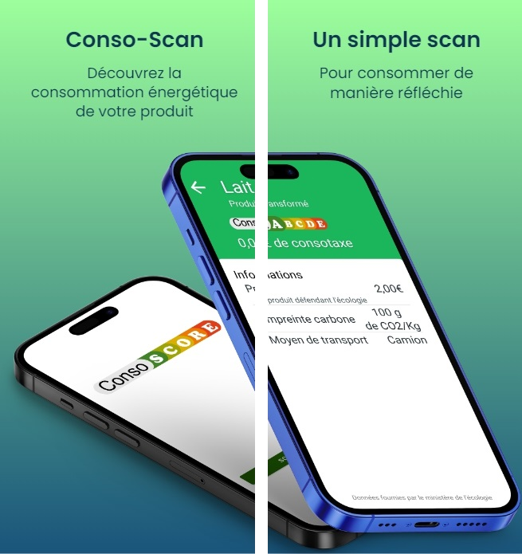

# conso-score-mobile-app
This repository is the mobile app that can read products and give information about the associated conso-score.

## Technology

The app is develop in Java Android.

It use the ZXing library for the barcode scanner, and retrofit2 for the communication with the back office.

The app interact with the back office on the root /datas/product/{codebar}

## Configure

To use this app, you need to run the consoscore back office, and then configure the address of the consoscore server.

To configure the server, specify the server address in the ConsoScore/app/build.gradle at the 17 line.

## How to compile

Simply open the ConsoScore dir in Android Studio.

if you want to build from command line, simply follow the information on the [Android Developper Wiki](
https://developer.android.com/studio/build/building-cmdline)
